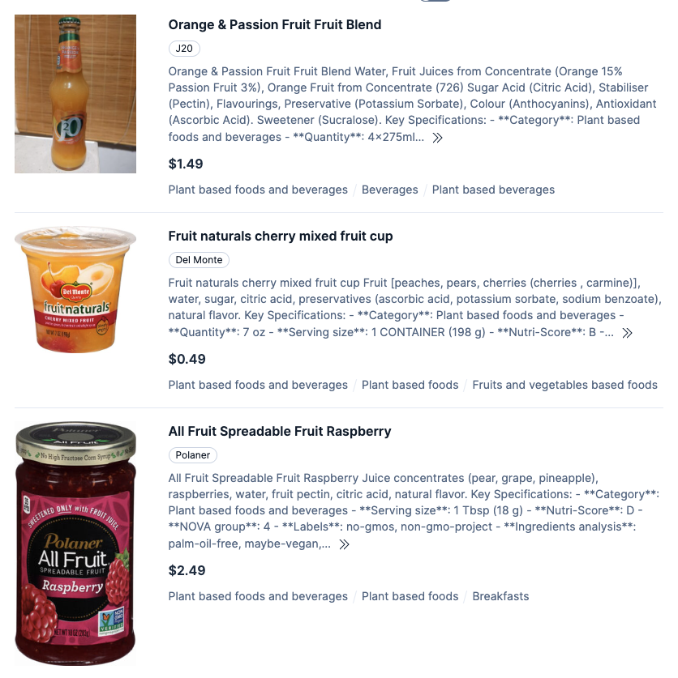

# open-food-facts-ndjson-extractor

Extract a clean **NDJSON** demo catalog from the Open Food Facts (OFF) JSONL export.

This repository contains **code only**. It does **not** ship Open Food Facts data or any derived dataset.

More context and rationale: [From messy product feeds to demo-ready e-commerce data](https://alexmarquardt.com/elastic/ecommerce-demo-data/)

## What this produces

This tool transforms raw, complex Open Food Facts data into a flattened, search-ready **NDJSON** format. 

### Schema Overview

| Field | Type | Description |
| :--- | :--- | :--- |
| `id` | string | GTIN-13 barcode (padded). |
| `title` | string | Product name (English). |
| `brand` | string | Manufacturer or brand name. |
| `description` | string | Synthesized description (Title + Ingredients + Key Specs). |
| `price` | float | Synthetic, deterministic price for e-commerce simulation. |
| `currency` | string | Currency code (default: USD). |
| `image_url` | string | Computed primary product image URL. |
| `categories` | list | Cleaned list of category tags. |
| `attrs` | object | **Flattened Dictionary** of key-value attributes (e.g., Nutri-Score, Energy). |
| `attr_keys` | list | List of all keys available in `attrs` for faceting. |
| `dietary_restrictions` | list | Extracted dietary tags (e.g., vegan, vegetarian). |

## Why this tool is necessary

The raw data from Open Food Facts is incredibly detailed but also complex, containing hundreds of fields, nested objects, and language-specific keys. This makes it difficult to use directly in many applications, especially search and recommendation engines that expect a simple, flat document structure.

This script transforms the raw data into a clean, consistent, and search-ready format. It performs several key operations:

*   **Selects a primary language:** It extracts titles and descriptions from a complex, multi-language structure into single `title` and `description` fields.
*   **Constructs a reliable image URL:** It navigates nested image metadata to build a single, high-quality `image_url`.
*   **Synthesizes a full description:** It combines the title, generic name, and key attributes into a comprehensive `description` field.
*   **Generates a synthetic price:** It creates a deterministic, plausible price to enable e-commerce simulations.
*   **Flattens the structure:** It extracts key attributes into a simple key-value `attrs` object.

### Before: Raw Open Food Facts Data Example

A single product can have over 500 fields. Key information like the product name or image URL is buried in nested objects and requires logic to extract.

```json
{
  "_id": "0008127000019",
  "pnns_groups_2": "Fats",
  "labels_old": "",
  "ingredients_from_palm_oil_tags": [],
  "brands": "Athena Imports",
  "code": "0008127000019",
  "editors_tags": [
    "aleene",
    "clockwerx",
    "ecoscore-impact-estimator",
    "kiliweb",
    "usda-ndb-import",
    "yuka.sY2b0xO6T85zoF3NwEKvlkBmTtT-iz2cKD3tvnWnxIyJDIfrfuxX2KLROas",
    "yuka.sY2b0xO6T85zoF3NwEKvlnAfXOTz-RmeOxLgh3egzemsPJb1YepV7aSnHas"
  ],
  "packaging_materials_tags": [],
  "ingredients_sweeteners_n": 0,
  "generic_name": "",
  "categories_properties": {
    "agribalyse_food_code:en": "17270",
    "ciqual_food_code:en": "17270",
    "agribalyse_proxy_food_code:en": "17270"
  },
  "nutriscore_2021_tags": [
    "c"
  ],
  "languages_tags": [
    "en:english",
    "en:1"
  ],
  "link": "",
  "purchase_places": "",
  "ingredients_with_unspecified_percent_sum": 100,
  "ingredients_with_specified_percent_n": 0,
  "origin_en": "",
  "nutriscore_version": "2023",
  "...": "hundreds of additional fields omitted"
}
```

### After: Cleaned NDJSON for Search Example

The output is a clean, flat JSON object, ready to be indexed into a search engine like Elasticsearch or OpenSearch.

```json
{
  "id": "0008127000019",
  "title": "Extra virgin olive oil",
  "brand": "Athena Imports",
  "description": "Extra virgin olive oil. Extra virgin olive oil Key specifications: Category: Plant based foods and beverages; Serving size: 15 ml; Nutri-Score: B; NOVA group: 2; Eco-Score: E; Dietary restrictions: vegan, vegetarian; Ingredients analysis: palm-oil-free, vegan, vegetarian; Energy (kcal/100g): 800 kcal; Fat (g/100g): 93.3 g; Saturated fat (g/100g): 13.3 g; Sugars (g/100g): 0 g; Salt (g/100g): 0 g; Protein (g/100g): 0 g; Countries: United States",
  "image_url": "https://images.openfoodfacts.org/images/products/000/812/700/0019/front_en.5.400.jpg",
  "price": 14.29,
  "currency": "USD",
  "categories": [
    "Plant based foods and beverages",
    "Plant based foods",
    "Fats"
  ],
  "attrs": {
    "Serving size": "15 ml",
    "Nutri-Score": "B",
    "NOVA group": "2",
    "Eco-Score": "E",
    "Ingredients analysis": "palm-oil-free, vegan, vegetarian",
    "Countries": "United States",
    "Category": "Plant based foods and beverages",
    "Energy (kcal/100g)": "800 kcal",
    "Fat (g/100g)": "93.3 g",
    "Saturated fat (g/100g)": "13.3 g",
    "Sugars (g/100g)": "0 g",
    "Salt (g/100g)": "0 g",
    "Protein (g/100g)": "0 g",
    "Dietary restrictions": "vegan, vegetarian",
    "Price source": "estimated_unit_model",
    "Pricing bucket": "oils_fats",
    "Estimated unit price": "11.59 USD/l (15ml, bucket=oils_fats, scale=1.21, ratio=0.15)"
  },
  "attr_keys": [
    "Category",
    "Countries",
    "Dietary restrictions",
    "Eco-Score",
    "Energy (kcal/100g)",
    "Estimated unit price",
    "Fat (g/100g)",
    "Ingredients analysis",
    "NOVA group",
    "Nutri-Score",
    "Price source",
    "Pricing bucket",
    "Protein (g/100g)",
    "Salt (g/100g)",
    "Saturated fat (g/100g)",
    "Serving size",
    "Sugars (g/100g)"
  ],
  "dietary_restrictions": [
    "vegan",
    "vegetarian"
  ]
}
```

## Clean data definition

- Title in target language: `product_name_{lang}` OR (`lang == {lang}` AND `product_name`) — controlled by `--lang`
- Description in target language: `generic_name_{lang}` OR `ingredients_text_{lang}` OR (`lang == {lang}` AND `generic_name`/`ingredients_text`)
- A front image matching the target language: `images.front_{lang}`
- If `--require-category` is enabled: at least one meaningful category (placeholder/empty categories excluded)
- Synthetic deterministic price (see Price Estimation)

## A small sample of cleaned NDJSON files

You can look into `data/sample-data` to see a few JSON product documents that were generated by the scripts in this repository

## Example search results with the cleaned data


## Data is not included in this repo

Users must download the OFF JSONL export at: [https://static.openfoodfacts.org/data/openfoodfacts-products.jsonl.gz](https://static.openfoodfacts.org/data/openfoodfacts-products.jsonl.gz)

Then place it in the data directory:

`data/json_source/openfoodfacts-products.jsonl.gz`

The script reads `.jsonl` or `.jsonl.gz` and streams it; it does not require full decompression.

## Price Estimation

The pricing information is synthetically generated by the `extract.py` script and is not a separate tool. The price estimation logic is based on a product's category, quantity, and other attributes, using the configuration from `config/pricing_buckets.json`. This process is integrated into the main extraction pipeline.

## Project Structure

```text
ecommerce-open-food-facts/
├── data/                  # All data lives here (ignored by git)
│   ├── json_source/       # Raw OFF data dump
│   │   └── openfoodfacts-products.jsonl.gz
│   └── products/          # Processed NDJSON files (The "Output")
├── src/
│   └── off_demo_extract/  # Python Package
│       └── extract.py
├── pyproject.toml         # Dependencies
└── README.md
```

## Quickstart (uv)

Create and run a small sample (recommended first step):

```bash
uv run -m off_demo_extract.extract \
  --lang en \
  --require-category \
  --output data/products/sample_2k_front_en.ndjson \
  --report data/products/sample_2k_front_en_report.json \
  --max-output-records 2000 \
  --max-input-lines 3000000
```

The script will prompt for confirmation if the output file already exists. To bypass this, add the `--yes` flag.

Run full extraction (no arbitrary cutoff; reads to EOF):

```bash
uv run -m off_demo_extract.extract \
  --lang en \
  --require-category \
  --output data/products/off_en_clean_categorized.ndjson \
  --report data/products/report_categorized.json \
  --progress-every 500000
```


## Licensing and data reuse (important)

- This repository’s code is licensed under the MIT License (see `LICENSE`).
- Open Food Facts data and images are governed by Open Food Facts’ licenses and terms.

OFF data reuse is based on ODbL (attribution + share-alike). Image URL construction follows OFF documentation.

See `DATA_LICENSE.md` for links to the authoritative Open Food Facts pages and a short summary.
