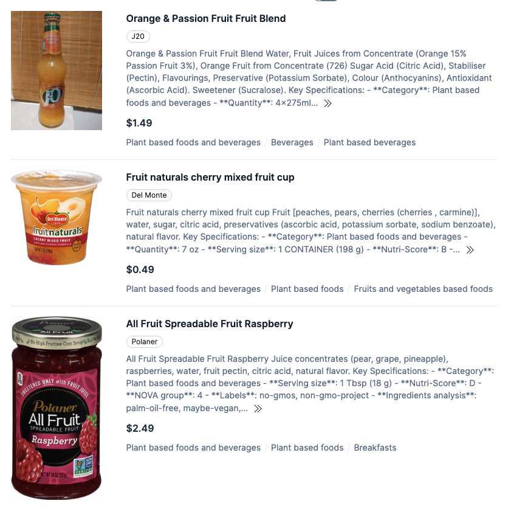

# open-food-facts-ndjson-extractor

Extract a clean **NDJSON** demo catalog from the Open Food Facts (OFF) JSONL export.

This repository contains **code only**. It does **not** ship Open Food Facts data or any derived dataset.

More context and rationale: [From messy product feeds to demo-ready e-commerce data](https://alexmarquardt.com/elastic/ecommerce-demo-data/)

## What this produces

This tool transforms raw, complex Open Food Facts data into a flattened, search-ready **NDJSON** format. 

### Schema Overview

| Field | Type | Description |
| :--- | :--- | :--- |
| `id` | string | GTIN-13 barcode (padded). |
| `title` | string | Product name (English). |
| `brand` | string | Manufacturer or brand name. |
| `description` | string | Synthesized description (Title + Ingredients + Key Specs). |
| `price` | float | Synthetic, deterministic price for e-commerce simulation. |
| `currency` | string | Currency code (default: USD). |
| `image_url` | string | Computed primary product image URL. |
| `categories` | list | Cleaned, flat list of the product's own category tags, de-duplicated, **validated against the taxonomy** (see [Tags that are not taxonomy categories](#tags-that-are-not-taxonomy-categories)) and rendered with the taxonomy's display name for `--lang` — the **same** label the matching `category_path` segment carries, so the two fields can be joined on string. |
| `category_path` | list | **Hierarchical** category path — a single root→leaf chain as cumulative `/`-joined strings (e.g. `["Snacks", "Snacks/Salty snacks", "Snacks/Salty snacks/Crisps"]`), reconstructed from the Open Food Facts category taxonomy graph. Powers breadcrumb-style, drill-down category facets. |
| `attrs` | object | **Flattened Dictionary** of key-value attributes (e.g., Nutri-Score, Energy). |
| `attr_keys` | list | List of all keys available in `attrs` for faceting. |
| `dietary_restrictions` | list | Extracted dietary tags (e.g., vegan, vegetarian). |

## Why this tool is necessary

The raw data from Open Food Facts is incredibly detailed but also complex, containing hundreds of fields, nested objects, and language-specific keys. This makes it difficult to use directly in many applications, especially search and recommendation engines that expect a simple, flat document structure.

This script transforms the raw data into a clean, consistent, and search-ready format. It performs several key operations:

*   **Selects a primary language:** It extracts titles and descriptions from a complex, multi-language structure into single `title` and `description` fields.
*   **Constructs a reliable image URL:** It navigates nested image metadata to build a single, high-quality `image_url`.
*   **Synthesizes a full description:** It combines the title, generic name, and key attributes into a comprehensive `description` field.
*   **Generates a synthetic price:** It creates a deterministic, plausible price to enable e-commerce simulations.
*   **Flattens the structure:** It extracts key attributes into a simple key-value `attrs` object.
*   **Reconstructs a category hierarchy:** It resolves the product's categories against the Open Food Facts category taxonomy graph to emit a single clean root→leaf `category_path` (see [Category hierarchy](#category-hierarchy)).

### Before: Raw Open Food Facts Data Example

A single product can have over 500 fields. Key information like the product name or image URL is buried in nested objects and requires logic to extract.

```json
{
  "_id": "0008127000019",
  "pnns_groups_2": "Fats",
  "labels_old": "",
  "ingredients_from_palm_oil_tags": [],
  "brands": "Athena Imports",
  "code": "0008127000019",
  "editors_tags": [
    "aleene",
    "clockwerx",
    "ecoscore-impact-estimator",
    "kiliweb",
    "usda-ndb-import",
    "yuka.sY2b0xO6T85zoF3NwEKvlkBmTtT-iz2cKD3tvnWnxIyJDIfrfuxX2KLROas",
    "yuka.sY2b0xO6T85zoF3NwEKvlnAfXOTz-RmeOxLgh3egzemsPJb1YepV7aSnHas"
  ],
  "packaging_materials_tags": [],
  "ingredients_sweeteners_n": 0,
  "generic_name": "",
  "categories_properties": {
    "agribalyse_food_code:en": "17270",
    "ciqual_food_code:en": "17270",
    "agribalyse_proxy_food_code:en": "17270"
  },
  "nutriscore_2021_tags": [
    "c"
  ],
  "languages_tags": [
    "en:english",
    "en:1"
  ],
  "link": "",
  "purchase_places": "",
  "ingredients_with_unspecified_percent_sum": 100,
  "ingredients_with_specified_percent_n": 0,
  "origin_en": "",
  "nutriscore_version": "2023",
  "...": "hundreds of additional fields omitted"
}
```

### After: Cleaned NDJSON for Search Example

The output is a clean, flat JSON object, ready to be indexed into a search engine like Elasticsearch or OpenSearch.

```json
{
  "id": "0008127000019",
  "title": "Extra virgin olive oil",
  "brand": "Athena Imports",
  "description": "Extra virgin olive oil. Extra virgin olive oil Key specifications: Category: Plant-based foods and beverages; Serving size: 15 ml; Nutri-Score: B; NOVA group: 2; Eco-Score: E; Dietary restrictions: vegan, vegetarian; Ingredients analysis: palm-oil-free, vegan, vegetarian; Energy (kcal/100g): 800 kcal; Fat (g/100g): 93.3 g; Saturated fat (g/100g): 13.3 g; Sugars (g/100g): 0 g; Salt (g/100g): 0 g; Protein (g/100g): 0 g; Countries: United States",
  "image_url": "https://images.openfoodfacts.org/images/products/000/812/700/0019/front_en.5.400.jpg",
  "price": 14.29,
  "margin": 22,
  "popularity": 0,
  "currency": "USD",
  "categories": [
    "Plant-based foods and beverages",
    "Plant-based foods",
    "Fats",
    "Vegetable fats",
    "Olive tree products",
    "Vegetable oils",
    "Olive oils",
    "Extra-virgin olive oils",
    "Virgin olive oils"
  ],
  "category_path": [
    "Plant-based foods and beverages",
    "Plant-based foods and beverages/Plant-based foods",
    "Plant-based foods and beverages/Plant-based foods/Olive tree products",
    "Plant-based foods and beverages/Plant-based foods/Olive tree products/Olive oils",
    "Plant-based foods and beverages/Plant-based foods/Olive tree products/Olive oils/Virgin olive oils",
    "Plant-based foods and beverages/Plant-based foods/Olive tree products/Olive oils/Virgin olive oils/Extra-virgin olive oils"
  ],
  "attrs": {
    "Serving size": "15 ml",
    "Nutri-Score": "B",
    "NOVA group": "2",
    "Eco-Score": "E",
    "Ingredients analysis": "palm-oil-free, vegan, vegetarian",
    "Countries": "United States",
    "Category": "Plant-based foods and beverages",
    "Energy (kcal/100g)": "800 kcal",
    "Fat (g/100g)": "93.3 g",
    "Saturated fat (g/100g)": "13.3 g",
    "Sugars (g/100g)": "0 g",
    "Salt (g/100g)": "0 g",
    "Protein (g/100g)": "0 g",
    "Dietary restrictions": "vegan, vegetarian",
    "Price source": "estimated_unit_model",
    "Pricing bucket": "olive_oil",
    "Estimated unit price": "28.68 USD/l (default 500ml (no package qty), source=none, bucket=olive_oil)",
    "Margin source": "modelled_category_margin",
    "Modelled margin": "22% (bucket=olive_oil base=22%)",
    "Popularity source": "open_food_facts_unique_scans",
    "Unique scans (Open Food Facts)": "0"
  },
  "attr_keys": [
    "Category",
    "Countries",
    "Dietary restrictions",
    "Eco-Score",
    "Energy (kcal/100g)",
    "Estimated unit price",
    "Fat (g/100g)",
    "Ingredients analysis",
    "Margin source",
    "Modelled margin",
    "NOVA group",
    "Nutri-Score",
    "Popularity source",
    "Price source",
    "Pricing bucket",
    "Protein (g/100g)",
    "Salt (g/100g)",
    "Saturated fat (g/100g)",
    "Serving size",
    "Sugars (g/100g)",
    "Unique scans (Open Food Facts)"
  ],
  "dietary_restrictions": [
    "vegan",
    "vegetarian"
  ]
}
```

## Category hierarchy

Open Food Facts ships `categories_tags` (and an identical `categories_hierarchy`)
on every product, but **those are not a single path** — they are the flattened
*union of every ancestor category* drawn from the Open Food Facts category
taxonomy, which is a directed acyclic graph (a category can have several
parents). Naively joining the tags with `/` mixes parallel roots and sibling
branches and yields a nonsense path.

To produce a real tree — the same cumulative-path shape merchandising tools use
for drill-down facets — the extractor loads the public OFF category taxonomy and
walks a single canonical chain:

1. **Once per run**, collapse the whole taxonomy DAG to a spanning forest by
   giving every category one canonical parent (see [Canonical parents and the
   tie-break](#canonical-parents-and-the-tie-break)).
2. Keep the product's tags that exist in the taxonomy (drops noise and
   foreign-language-only nodes for the target language).
3. Pick the most specific of those tags as the leaf, and walk the canonical
   parent map from it to a **global** taxonomy root — materialising ancestors the
   product never tagged.
4. Emit cumulative `/`-joined path strings using the taxonomy's localized display
   names.

```text
raw tags:   en:plant-based-foods-and-beverages, en:beverages, en:hot-beverages,
            en:plant-based-beverages, en:teas, en:tea-bags        (a flat DAG union)

category_path:
  [ "Beverages",
    "Beverages/Hot beverages",
    "Beverages/Hot beverages/Teas" ]                              (one clean chain)
```

### Canonical parents and the tie-break

Step 1 is what makes the hierarchy usable for faceting, and it is the reason the
walk is anchored globally rather than to the product's own tags. Two properties
have to hold, and both are covered by tests in `tests/test_taxonomy.py`:

- **One address per category.** A category occupies exactly one position in the
  tree, so every product carrying it files it at the same path. Anchoring only to
  the product's own tags broke this whenever a product omitted an intermediate
  tag: the walk stopped at whatever the product happened to hold and invented a
  shorter path, so the same category showed up at two addresses and its facet
  count split in two.
- **One path per product.** Each product carries exactly one root→leaf chain,
  never a union of branches.

The canonical parent of each node is chosen by **fewest hops to a taxonomy root**,
and **on a tie the lexicographically smallest canonical id wins**. The tie-break
is not a corner case: 2,545 of the 14,457 categories have several parents and
1,070 of those tie on depth, so it decides nearly half the multi-parent cases.

It has to be *stable across taxonomy refreshes* — if a category's address moved
between rebuilds, previously authored merchandising rules would silently stop
matching. Lexicographic order depends only on the set of tied ids, so upstream
re-ordering a `parents` list cannot move an address. On the current taxonomy all
2,545 multi-parent nodes already list their parents in lexicographic order, so
this rule agrees with the upstream authored order on every tie today, while not
being hostage to it.

Collapsing the DAG this way cuts 2,769 of the taxonomy's 17,134 parent edges and
orphans **zero** categories: every non-root keeps exactly one parent and all 92
roots stay roots. Only redundant parent relationships are dropped.

Each run's report carries a `category_path_addresses` block counting the
categories that resolved to more than one address, the categories that rendered
under more than one label, and the labels claimed by more than one category. All
three should always read zero; if any does not, the extraction log says so.

### One label per category

The flat `categories` list is still emitted alongside the hierarchical
`category_path` (it also drives pricing-bucket matching and the `attrs.Category`
field). Both are derived from the product's `categories_tags`, and **both take a
category's label from one function** — `display_label` in
`src/off_demo_extract/taxonomy.py` — so a change to how categories are named
cannot reach one field and not the other.

That label is the taxonomy's `name` for `--lang`, falling back to English, then
`xx`, then a prettified slug. It is preferred over de-slugging the tag id because
it is the upstream-authored human label: it carries correct hyphenation
(`Plant-based foods`), disambiguating parentheticals (`Crackers (Appetizers)`)
and casing that a mechanical de-slug destroys — and, unlike a slug, it is
localized. All 8,939 English-backbone nodes have an English name, so the slug
fallback never fires on that backbone.

`categories` used to de-slug the tag id itself. That gave the same node two
spellings across the two fields (`Plant based foods` next to `Plant-based
foods`), so nothing could relate a flat value to a path segment by string: over
the first 200,000 lines of the public export, only 75.1% of products had every
self-tagged chain node's label present verbatim in `categories`; it is now 100%.
Because the de-slug worked off the `en:`-prefixed tag id, it also emitted English
labels in **every** locale — a Spanish catalog rendered `Plant based foods` in
`categories` and `Alimentos de origen vegetal` in `category_path`, in the same
document. Both fields are now localized together.

Where the taxonomy has no translation the label falls back to English in both
fields, which is a gap in the upstream taxonomy rather than a disagreement
between the fields: of the 8,939 English-backbone nodes, 86.0% have a French name
and 34.6% a Spanish one.

Note that the two fields are *relatable*, not identical: `category_path` is
anchored to a global taxonomy root, so it materialises ancestors the product
never tagged, and those ancestors are legitimately absent from `categories`.
`tests/test_category_label_agreement.py` pins the direction that must hold —
every chain node the product *did* tag appears verbatim in `categories` — by
exact string, on real Open Food Facts records.

### Tags that are not taxonomy categories

A product's `categories_tags` are **not** guaranteed to be taxonomy nodes. Legacy
tags, contributor-entered tags and tags upstream has since renamed all ride along
in the export. Measured over the first 300,000 records of the January 2026 dump
against the pinned 14,457-node snapshot, after the `en:undefined`/`en:null`
sentinels `--category-exclude` already removes:

| | |
| :--- | ---: |
| products with a real category tag | 218,239 |
| tag instances | 1,171,851 |
| instances with no taxonomy node | 49,962 (4.26%) |
| distinct such tags | 7,712 |
| products carrying at least one | 42,727 (19.6%) |
| products where *every* tag is one | 5,456 (2.50%) |

Those tags used to be rendered into the searchable `categories` field as if they
were canonical. `Groceries` alone was searchable on 6,299 documents of the built
English catalog — a value with no node in the hierarchy, so it can never be a
`category_path` segment and can never be authored as a merchandising rule value.
It is also a value the labeller has no `name` to render, only a slug.

Each tag now goes through, in order:

1. **A curated alias map** — `TAG_ALIASES` in
   `src/off_demo_extract/category_tags.py`, an id upstream retired mapped to the
   node that *is* that category today (`en:easter-food` →
   `en:easter-foods-and-drinks`). Most entries are derived from upstream's own
   synonym lines, which is where a rename leaves its trace; the two that are not
   are marked inline. Aliases are canonicalizations, never generalizations: a tag
   is never filed under a *broader* node, because that would put a product in a
   category it never claimed.
2. **A curated drop list** — `TAG_DROPS`, each entry carrying the reason it is
   refused. `en:groceries` is 36.6% of all unresolvable instances on its own and
   is contentless in a grocery catalog; `en:aoc-cheeses` and `en:labeled-cheeses`
   are label *attributes* rather than places in a product hierarchy.
3. **Membership in the run's category vocabulary** — the same node set the
   hierarchical path is allowed to walk, so the two fields cannot draw on
   different vocabularies. A tag that is a real node but in a language this
   catalog does not place in a path (`fr:charcuteries-cuites` in an English
   catalog) is refused here too: `category_path` already refuses it, so leaving
   it in the flat field produces a value that is searchable but never facetable.

**A refused value never refuses its record.** Dropping the record on an
unresolvable tag would cost 19.6% of tagged products; dropping only the offending
value costs 2.50%, because in 87% of cases the product has a complete valid
lineage and one junk tag riding along. The 2.50% that end up with nothing are
exactly the products `--require-category-path` already drops.

Every run reports what it refused, in a `category_tag_curation` block: totals by
reason, the distinct unresolvable-tag count, the rate, and the worst offenders by
name. The rate is meant to be read per run — this defect was originally found by
reverse-mapping a built index against the taxonomy, which nobody should have to
do twice.

The taxonomy file is fetched once from
[`https://static.openfoodfacts.org/data/taxonomies/categories.json`](https://static.openfoodfacts.org/data/taxonomies/categories.json)
and cached at `data/taxonomy/categories.json`. Override its location with
`--taxonomy <path>`. Display names follow `--lang`, so the French and Spanish
personas get localized category labels — in `categories` as well as in
`category_path`.

### Category-hierarchy flags

Two separate flags control the hierarchy. They are easy to confuse, so here is
exactly what each does:

- **`--no-taxonomy`** — turns the hierarchy feature *off entirely*. The extractor
  does **not** load (or download) the taxonomy, and every product is written with
  an empty `category_path` (`[]`). The flat `categories` field is still written,
  but with no taxonomy there are no display names to read, so its labels fall
  back to a prettified slug of the tag id — English, and without the taxonomy's
  hyphenation or parentheticals. With no taxonomy there is also no vocabulary to
  validate tags against, so only the curated drop list applies and the rest are
  emitted unchecked; refusing everything would blank the field for the whole run.
  Use this to skip the download when you don't need the hierarchy and are not
  relying on category labels.
- **`--require-category-path`** *(default: on)* — **drops products whose
  `category_path` can't be reconstructed**, so the catalog is uniformly
  drill-down-faceted. This is a small tail — roughly 2–6% of otherwise-clean
  records in the EN/FR/ES full runs. Pass `--no-require-category-path` to keep
  those products with an empty `category_path` instead.

  "Reconstructed" means **anchored**, not merely non-empty. A chain is walked to
  a root of the parent map built for *this* run, and that map holds only the
  languages this catalog may place in a path — so a node whose only parent is
  foreign is promoted to a root of the map while staying a child of the taxonomy.
  90 of the 161 roots an English run sees are manufactured that way. `en:pate`
  really sits under `fr:charcuteries-diverses` under `en:prepared-meats`, so an
  English catalog would file it as a top-level `Pâté` that no other catalog
  agrees with. Those chains are refused too, and counted separately from the
  empty ones. It is a thin slice: over the first 300,000 records of the January
  2026 dump an English run resolves 455 unanchored chains (French, 2), of which
  6 also clear the title/description/image filters and would otherwise have been
  written — 16,847 records out instead of 16,853. Every refusal is named in the
  report's `category_path_anchoring` block, which is populated whether or not the
  gate is on.

The interaction is the part to watch: with `--no-taxonomy` *every* path is empty,
so naively "requiring a path" would drop **every** product and produce an empty
file. To prevent that, **`--no-taxonomy` automatically disables the
require-path gate** (a log line notes this). The same graceful handling applies
if the taxonomy simply fails to load (e.g. no network on first run): paths come
out empty, the gate is disabled, and the run continues rather than crashing or
silently emitting an empty dataset.

| Flags | `category_path` | Products dropped for an unresolved path? |
| :--- | :--- | :--- |
| *(default)* | populated from the taxonomy | **Yes** — the ~2–6% empty tail, plus the thin unanchored slice |
| `--no-require-category-path` | populated from the taxonomy | No (both are still counted in the report) |
| `--no-taxonomy` | always `[]` | No (gate auto-disabled) |
| taxonomy fails to load | always `[]` | No (gate auto-disabled, with a warning) |

## Clean data definition

- Title in target language: `product_name_{lang}` OR (`lang == {lang}` AND `product_name`) — controlled by `--lang`
- Description in target language: `generic_name_{lang}` OR `ingredients_text_{lang}` OR (`lang == {lang}` AND `generic_name`/`ingredients_text`)
- A front image matching the target language: `images.front_{lang}`
- If `--require-category` is enabled: at least one meaningful category (placeholder/empty categories excluded)
- By default, a `category_path` that resolves against the OFF taxonomy **and reaches one of its 92 global roots** — products whose hierarchy can't be reconstructed, and products whose chain starts mid-taxonomy because the language filter severed its ancestry, are both excluded (disable with `--no-require-category-path`)
- Synthetic deterministic price (see Price Estimation)

## A small sample of cleaned NDJSON files

You can look into `data/sample-data` to see a few JSON product documents that were generated by the scripts in this repository

## Example search results with the cleaned data


## Data is not included in this repo

Users must download the OFF JSONL export at: [https://static.openfoodfacts.org/data/openfoodfacts-products.jsonl.gz](https://static.openfoodfacts.org/data/openfoodfacts-products.jsonl.gz)

Then place it in the data directory:

`data/json_source/openfoodfacts-products.jsonl.gz`

The script reads `.jsonl` or `.jsonl.gz` and streams it; it does not require full decompression.

## Price Estimation

The pricing information is synthetically generated by the `extract.py` script and is not a separate tool. The price estimation logic is based on a product's category, quantity, and other attributes, using the configuration from `config/pricing_buckets.json`. This process is integrated into the main extraction pipeline.

## Project Structure

```text
ecommerce-open-food-facts/
├── data/                  # All data lives here (ignored by git)
│   ├── json_source/       # Raw OFF data dump
│   │   └── openfoodfacts-products.jsonl.gz
│   ├── taxonomy/          # Cached OFF category taxonomy (auto-downloaded)
│   │   └── categories.json
│   └── products/          # Processed NDJSON files (The "Output")
├── src/
│   └── off_demo_extract/  # Python Package
│       ├── extract.py     # Main extraction pipeline
│       ├── taxonomy.py    # OFF taxonomy graph → hierarchical category_path
│       ├── category_tags.py  # Curated aliases/drops + validation of product tags
│       └── pricing.py     # Synthetic price model
├── tests/
│   ├── conftest.py        # Puts src/ on sys.path so tests import normally
│   ├── test_business_signal_values.py  # margin / popularity derivation
│   ├── test_canonical_parents.py       # Canonical parent map and its tie-break
│   ├── test_category_addressing.py     # One address per category, one path per product
│   ├── test_category_path_gate.py      # End-to-end tests for the category_path gate
│   ├── test_taxonomy.py   # Regression tests for the hierarchy builder
│   └── fixtures/          # Real OFF products + pruned taxonomy, checked in
├── pyproject.toml         # Dependencies
└── README.md
```

### Running the tests

The tests need no network and no data dump — they build a synthetic taxonomy and
a two-record input on the fly:

```bash
uv run --with pytest python -m pytest tests/ -v
```

Each test file is also runnable on its own (`python tests/test_taxonomy.py`).
CI runs the same suite on every push and pull request.

## Quickstart (uv)

Create and run a small sample (recommended first step):

```bash
uv run -m off_demo_extract.extract \
  --lang en \
  --require-category \
  --output data/products/sample_2k_front_en.ndjson \
  --report data/products/sample_2k_front_en_report.json \
  --max-output-records 2000 \
  --max-input-lines 3000000
```

The script will prompt for confirmation if the output file already exists. To bypass this, add the `--yes` flag.

Run full extraction (no arbitrary cutoff; reads to EOF):

```bash
uv run -m off_demo_extract.extract \
  --lang en \
  --require-category \
  --output data/products/off_en_clean_categorized.ndjson \
  --report data/products/report_categorized.json \
  --progress-every 500000
```


## Licensing and data reuse (important)

- This repository’s code is licensed under the MIT License (see `LICENSE`).
- Open Food Facts data and images are governed by Open Food Facts’ licenses and terms.

OFF data reuse is based on ODbL (attribution + share-alike). Image URL construction follows OFF documentation.

See `DATA_LICENSE.md` for links to the authoritative Open Food Facts pages and a short summary.
